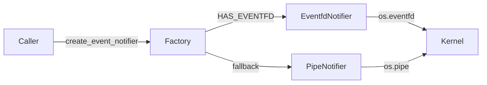

# Cross-Platform Event Notification

Location: `lmcache/v1/platform/event_notifier.py`
(re-exported from the `lmcache.v1.platform` package)

## Background

LMCache's multiprocess / distributed runtime uses a large number of
**pollable file descriptors** to wake background loops from other
threads:

- `mq.MessageQueueServer._output_efd` — notify the poller that a
  response frame is ready on the thread-pool output queue.
- `StoreListener._event_fd` — notify the store-controller loop that
  L1 has finished writing new keys.
- `PrefetchController._submission_efd` — notify the prefetch loop of
  a newly submitted request.
- Every `L2Adapter` exposes three event fds
  (`get_store_event_fd()`, `get_lookup_and_lock_event_fd()`,
  `get_load_event_fd()`) so controllers can `select.poll()` across
  all adapters in a single loop.

Previously these were all raw `os.eventfd(...)`. `os.eventfd` is a
Linux-only syscall, which blocks the MP/distributed stack from
running on macOS (and any other non-Linux POSIX system).

## Goals

1. Let the exact same code paths run on Linux (using `eventfd`) and
   on macOS / other POSIX (using a self-pipe).
2. Keep the call-site diff small — existing sites should look as
   close as possible to the `os.eventfd(...)` version they replace.
3. No global state, no monkey-patching of `os`, no hidden
   process-wide registries.
4. Give callers a single abstraction rather than each module doing
   its own `hasattr(os, "eventfd")` dance.

## Non-Goals

- Cross-process signaling. `EventNotifier` is for in-process
  thread-to-thread wake-ups. The fd is created in one process and
  never shared via IPC.
- Counting semaphore semantics. `notify()` is a **binary signal**;
  coalescing is expected.

## Design

### Public API

```python
# lmcache/v1/platform/event_notifier.py
# (re-exported via `lmcache.v1.platform` for short imports)

class EventNotifier(ABC):
    def fileno(self) -> int: ...      # poll-able fd
    def notify(self) -> None: ...     # signal (idempotent)
    def consume(self) -> None: ...    # drain (non-blocking)
    def close(self) -> None: ...      # idempotent

    def __enter__(self) -> "EventNotifier": ...
    def __exit__(self, *exc) -> None: ...

def create_event_notifier() -> EventNotifier: ...
def consume_fd(fd: int) -> None: ...
```

Two concrete implementations:

| Implementation    | Backend      | Selected when                    |
|-------------------|--------------|----------------------------------|
| `EventfdNotifier` | `os.eventfd` | `HAS_EVENTFD` (Linux + Py 3.10+) |
| `PipeNotifier`    | `os.pipe`    | otherwise (macOS / other POSIX)  |

Selection is centralized in `create_event_notifier()`; callers never
branch on the platform. `HAS_EVENTFD` is defined as
`hasattr(os, "eventfd")` in `lmcache/v1/platform/event_notifier.py`
and re-exported from the `lmcache.v1.platform` package — the single
source of truth for platform capability detection.

On non-Linux platforms the `EventfdNotifier` symbol still exists as
a placeholder whose `__init__` raises `RuntimeError`, so
`isinstance(..., EventfdNotifier)` checks in tests stay valid.

`consume_fd(fd)` is a module-level helper for callers that only have
a raw fd (typical case: a controller that received an fd via
`adapter.get_store_event_fd()` and wants to drain it after
`poll()`). It dispatches to the right syscall based on the same
`HAS_EVENTFD` flag.

### Semantics

`EventNotifier` models a **binary signal**:

- After `notify()`, the fd is readable via `select.poll()`.
- `consume()` drains all pending signals so the fd is no longer
  readable.
- Multiple `notify()` calls before a `consume()` are coalesced.
  Callers must not rely on a counter — they must re-check the
  underlying work queue after being woken.
- `consume()` is non-blocking and safe to call on an unsignaled fd.
- `close()` is idempotent.

### Exception contract

`consume()` and the module-level `consume_fd(fd)` helper **only
swallow `BlockingIOError`** (i.e. "no data pending on a non-blocking
fd"). Every other `OSError` subclass — most importantly `EBADF` from
a stale or already-closed fd — propagates to the caller so caller
bugs surface instead of being silently absorbed.

`notify()` swallows `BlockingIOError` in `PipeNotifier` because a
full pipe means a signal is *already* pending, which is the
post-condition we want. On `EventfdNotifier`, the counter only
blocks on overflow (max `2**64 - 2`), which we treat as unreachable
in practice.

`close()` is fully idempotent and swallows any `OSError` during
`os.close`, since there is nothing a caller could do about it.

### Backend Differences

**`EventfdNotifier`** (Linux) wraps a single eventfd opened with
`EFD_NONBLOCK | EFD_CLOEXEC`. `notify()` writes `1`, `consume()`
reads the 8-byte counter.

**`PipeNotifier`** (macOS / other POSIX) wraps an `os.pipe()` pair.
Since Python 3.4 (PEP 446) `os.pipe()` already sets `FD_CLOEXEC`,
so `__init__` only needs to flip both ends to non-blocking via
`os.set_blocking(fd, False)` — a portable API that avoids pulling
in `fcntl` and is friendlier to a future Windows pipe backend. If
either `set_blocking` call fails, both fds are closed before the
error propagates so no descriptors leak.

`notify()` writes a single `\x01` byte; `consume()` drains the read
end in a loop. If the pipe buffer is full, `notify()` is a no-op —
the signal is already pending. Both `PipeNotifier.consume()` and
the module-level `consume_fd()` treat an empty read (`b''`, i.e.
the write end was closed) as "drained" and stop looping, so a dead
pipe can never spin a background event loop.

### Architecture



## Call-Site Migration

Before (Linux-only):

```python
import os
self._event_fd = os.eventfd(0, os.EFD_NONBLOCK | os.EFD_CLOEXEC)
...
os.eventfd_write(self._event_fd, 1)
...
os.eventfd_read(self._event_fd)
...
os.close(self._event_fd)
```

After (cross-platform):

```python
from lmcache.v1.platform import create_event_notifier

self._event_fd = create_event_notifier()
...
self._event_fd.notify()
...
self._event_fd.consume()        # or: consume_fd(raw_fd)
...
self._event_fd.close()
```

The field name (`_event_fd`, `_output_efd`, `_submission_efd`, etc.)
is kept deliberately — the variable is still "the thing you poll
on", and reusing the name keeps the diff focused on the semantic
change.

## Testing

Unit tests live in `tests/v1/test_event_notifier.py`. They cover:

- **`TestEventNotifierAPI`** — platform-agnostic contract:
  factory returns an `EventNotifier` subclass; `fileno()` returns a
  valid fd; `notify()` makes the fd readable and `consume()` clears
  it; multiple `notify()` calls coalesce; `consume()` and `close()`
  are idempotent; context-manager usage.
- **`TestPipeNotifier`** — pipe-specific: both read/write fds are
  released by `close()`; pipe-full triggers the `BlockingIOError`
  swallow path in `notify()`; many create/close cycles do not leak
  fds; fd is pollable.
- **`TestConsumeFd`** — the `consume_fd(raw_fd)` utility drains a
  signaled fd and is a no-op on an unsignaled one.
- **`TestBackendSelection`** — asserts the factory picks
  `EventfdNotifier` when `HAS_EVENTFD` and `PipeNotifier` otherwise.
- **`TestForcedPipeFallback`** — on Linux CI the factory would
  normally return `EventfdNotifier`; this class `monkeypatch`es
  `HAS_EVENTFD` to `False` so the pipe fallback (and `consume_fd`'s
  pipe branch) is exercised on every platform.
